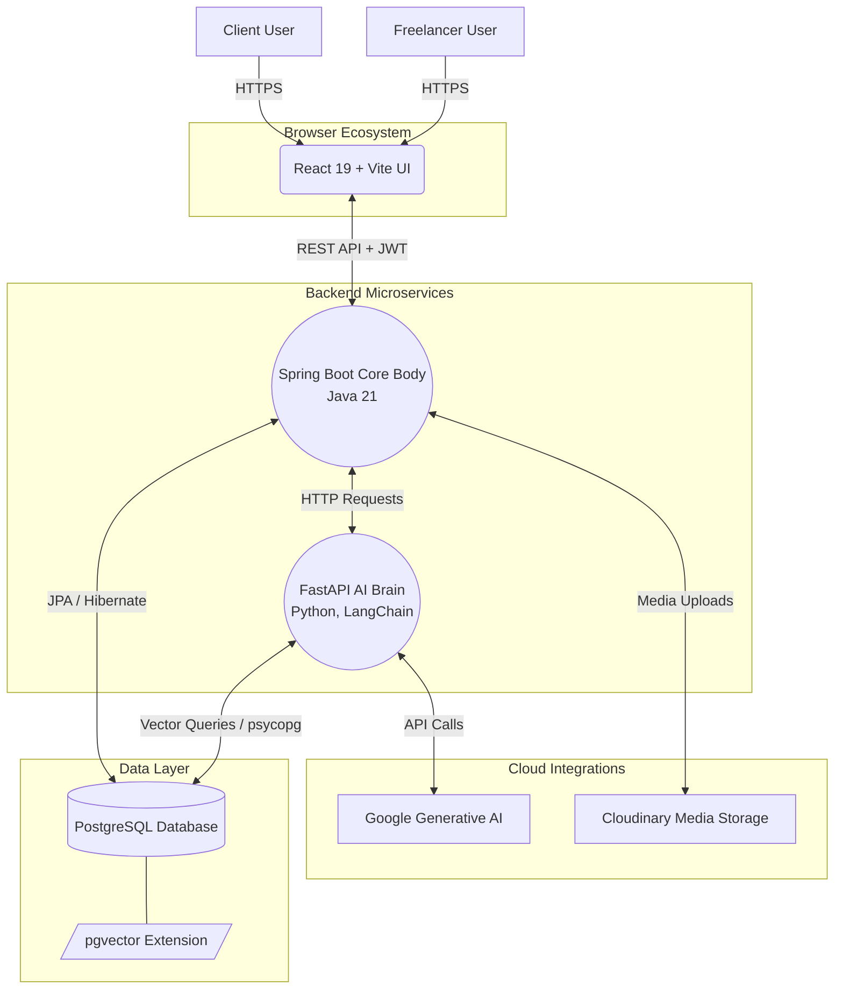

# Project Documentation: Ajinkya Infotech

Below are detailed, theoretical points covering the architectural and technical aspects of the Ajinkya Infotech project tailored to the specified sections.

## 1. Title
**Ajinkya Infotech: An AI-Powered Next-Generation Freelancing Ecosystem**

## 2. Introduction
Ajinkya Infotech is an advanced, AI-driven digital marketplace explicitly engineered to bridge the gap between high-caliber freelance professionals and clients seeking specialized services. As the modern gig economy expands, platforms must evolve beyond basic listing boards. Ajinkya Infotech represents this evolution by incorporating a sophisticated, decoupled architecture that pairs a high-performance Java Spring Boot backend with an intelligent Python-based AI microservice. By leveraging modern frontend solutions alongside vector-based artificial intelligence, the platform guarantees an intelligent, streamlined, dynamic, and highly secure environment for modern professional networking and project collaboration.

## 3. Problem Statement
The current landscape of freelancing platforms struggles with multiple systemic inefficiencies. Primarily, they rely on rigid, keyword-based search algorithms that fail to understand the contextual nuance of a client's requirements or a freelancer's true skill set, leading to sub-optimal project matching and wasted time. Furthermore, conventional platforms often suffer from monolithic architectures that are difficult to scale, result in generic user experiences, and lack intelligent workflows (e.g., assisted drafting or semantic matching). There is a critical necessity for a platform that employs a multi-service architecture, infuses generative AI and vector search directly into its core logic, and guarantees a seamless, modern user experience without compromising on enterprise-grade security.

## 4. Objectives and Scope

### 4.1 Objectives
*   **Intelligent Semantic Matching:** To move beyond basic keyword searching by utilizing cutting-edge AI embeddings (via Google Generative AI and `pgvector`) to semantically match freelancers with the most relevant job postings.
*   **Robust Multi-Service Architecture:** To implement a scalable, failure-resistant system by separating business logic (Spring Boot Core) from computationally intensive AI operations (Python FastAPI Brain).
*   **Engaging, State-of-the-Art User Experience:** To deliver a highly responsive, single-page application (SPA) with cinematic micro-animations and intuitive workflows using React 19, Tailwind CSS, and Framer Motion.
*   **Enterprise-Grade Security & Media Management:** To ensure robust data protection through stateless token-based authentication (JWT) and reliable media storage solutions via seamless Cloudinary integration.

### 4.2 Scope
*   **Platform Actors:** Comprehensive features for two primary user flows: Clients (job posters) and Freelancers (job seekers and profile builders).
*   **Core Modules:** Secure user authentication, profile portfolio management, job creation, application tracking, and an intelligent recommendation engine powered by RAG (Retrieval-Augmented Generation).
*   **Data Domain:** Management of both traditional relational datasets (users, jobs, transactions) and high-dimensional vector data (for AI proximity search) within a unified PostgreSQL database environment.

## 5. Methodological Details

### 5.1 Designing and Developing a Freelancing Platform
The methodology employed in developing Ajinkya Infotech revolves around a **Multi-Service containerized architecture**. This paradigm ensures that each component can be developed, optimized, and scaled independently.

*   **The Presentation Layer (Frontend):** 
    Built as a highly reactive Single Page Application (SPA), the presentation layer utilizes **React (v19)** and **Vite** for incredibly fast Hot Module Replacement (HMR) and optimized build times. State and navigation are handled dynamically, ensuring no page refreshes. Visual aesthetics and layouts are rapidly prototyped and maintained using **TailwindCSS**, while **Framer Motion** calculates complex layout animations and gestures, giving the platform a premium, application-like feel.

*   **The Transactional & Business Logic Layer (Spring Boot Body):** 
    The core operating structure of the platform runs on **Java 21** using the **Spring Boot** framework. It acts as the primary orchestrator, receiving requests from the frontend and securely processing them via **Spring Security** and JWT filters. It enforces business rules, handles file upload validations forwarding to **Cloudinary**, and performs CRUD operations utilizing **Spring Data JPA**.

*   **The Intelligence Layer (Python AI Brain):** 
    A standalone microservice built with **Python** and **FastAPI**. This component acts as the "Brain" of the platform. It intercepts requests requiring complex natural language processing or semantic search. Powered by **LangChain** and **Google Generative AI**, it generates embeddings of freelancer profiles and jobs. This allows the system to execute Retrieval-Augmented Generation (RAG) tasks efficiently. 

*   **The Unified Data Layer:**
    Instead of maintaining disparate databases, Ajinkya Infotech intelligently leverages **PostgreSQL** enriched with the **pgvector** extension. This allows the Java backend to store standard relational tables, while the Python backend stores and queries multi-dimensional vector embeddings within the same distinct data ecosystem.

#### Architecture Diagram

## 6. Modern Engineering Tools Used
The Ajinkya Infotech platform is engineered using a modern, industry-standard tech stack tailored for performance and AI integration:

*   **Frontend Technologies:**
    *   **React (v19) & Vite:** For building a robust, high-performance UI and component tree.
    *   **TailwindCSS:** For utility-first, highly customizable, and responsive styling.
    *   **Framer Motion:** For integrating complex, declarative animations based on state changes.
    *   **TipTap:** For providing users with a robust, headless rich text editor experience.

*   **Backend Technologies (Core):**
    *   **Java 21 & Spring Boot (3.x):** For creating robust, scalable foundational backend infrastructure.
    *   **Spring Security & JWT (io.jsonwebtoken):** For enforcing strict, stateless token-based authorization.
    *   **Hibernate / Spring Data JPA:** For seamless object-relational mapping.
    *   **Cloudinary SDK:** For cloud-based image and media processing.

*   **AI Microservice Technologies:**
    *   **Python & FastAPI:** For spinning up blazing-fast API endpoints tailored for data science logic.
    *   **LangChain:** For orchestrating LLM chains, connecting prompts, models, and output parsers.
    *   **Google Generative AI SDK:** For generating cutting-edge text embeddings and inference operations.

*   **Database Integration:**
    *   **PostgreSQL:** The core relational database management system.
    *   **pgvector:** An open-source extension for PostgreSQL enabling fast and scalable vector similarity search functionality directly within the SQL environment.

*   **Infrastructure & Containerization:**
    *   **Docker & Docker Compose:** Used to containerize the Frontend, Spring Boot App, Python AI Brain, and PostgreSQL database, guaranteeing consistent parity across different environments.
